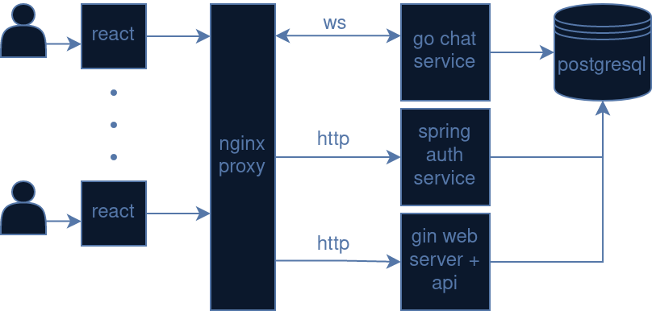

# gochat
Web chat application.

## compile and build images
```
sudo docker compose build auth chatserver webapp
```

## intialize db
create tables and add mock data
```
sudo docker compose --profile initdb up --abort-on-container-exit && sudo docker compose --profile initdb down
```

## run
execute command and access "localhost:80"
```
sudo docker compose --profile all up
```

## erase db data
```
sudo docker volume rm gochat_db
```

## description

components:
- web server using Go, Gin, GORM and JWT
- chat service using Go, websockets, GORM and JWT
- chat client using React and websockets
- auth service using Java Spring Boot and JWT
- nginx proxy
- postgresql db

architecture diagram:

<p style="text-align: center">
  
</p>

## tests (todo)